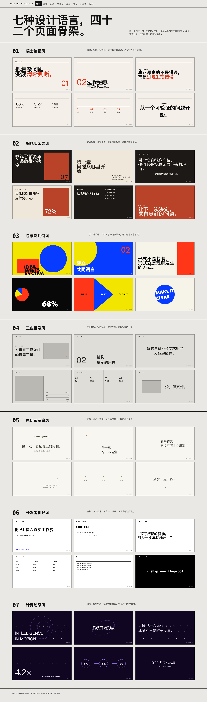

# HTML PPT Maker

一个中文 HTML-first PPT 生成 Skill。它先通过真实模板预览确认风格，再完成主题内容设计、视觉与生图规划、动态 HTML 演示稿生成，并可导出与 HTML 最终状态一致的 PowerPoint 文件。



## 它解决什么问题

普通的 AI PPT 工作流常见三个问题：

- 没有先确认文本展示和版式风格，生成后反复推翻。
- 页面只有标题、段落和重复卡片，缺少真正的视觉结构。
- HTML 预览很好看，但下载的 PPTX 变成另一份简化提纲。

这个 Skill 将演示稿拆成一条可审计的生产流程：

```text
资料输入
  -> 风格确认
  -> 内容与故事线
  -> 视觉系统与逐页版式契约
  -> HTML 动态演示稿
  -> 自动审计与人工视觉审稿
  -> HTML-matched PPTX
```

## 核心能力

- **制作前风格确认**：从真实模板中选择主模板、页面骨架和构图签名。
- **主题内容设计**：根据受众、场景、目标和页数建立故事线与逐页规划。
- **视觉设计与生图**：定义字体、色彩、网格、图片策略、视觉概念和生图任务。
- **逐页版式审计**：每页声明视觉锚点、视觉翻译、元素预算、审美风险和通过标准。
- **双轨渲染**：结构化信息图走确定性引擎，封面、章节和关键视觉页走定制 hand 轨道。
- **HTML 动效**：支持 reveal、stagger、count-up、路径绘制、键盘翻页和静态最终态。
- **HTML-matched PPTX**：把 HTML 最终状态渲染为全页 PPTX，并自动注入页面转场。
- **质量门**：检查溢出、裁切、重叠、关系线穿字、数字字体、图片裁切和版式同质化。

## 风格库

内置 7 种设计方向，每种包含 cover、section、statement、data、process、close 六类页面骨架：

| 模板 ID | 设计方向 | 适合场景 |
|---|---|---|
| `swiss-editorial` | 瑞士编辑风 | 商务汇报、产品策略、数据表达 |
| `magazine-editorial` | 编辑部杂志风 | 观点分享、公开课、品牌故事 |
| `bauhaus-geometric` | 包豪斯几何风 | 创意表达、设计主题、发布活动 |
| `dieter-rams` | 工业目录风 | 产品说明、硬件、方法论 |
| `kenya-hara` | 原研哉留白风 | 品牌、人文、概念演讲 |
| `brutalist-developer` | 开发者编辑器风 | AI、编程工具、技术教程 |
| `field-motion` | 计算动态风 | 封面、章节锚点、实验性表达 |

打开 [`assets/style-library/index.html`](assets/style-library/index.html) 可以查看完整模板图谱。

## 安装

### Codex

将仓库克隆到 Codex Skills 目录：

```bash
git clone https://github.com/349840432m-dev/html-ppt-maker.git \
  ~/.codex/skills/html-ppt-maker
```

安装后重启 Codex，或重新加载 Skills。

已有 Git 仓库版本时可更新：

```bash
git -C ~/.codex/skills/html-ppt-maker pull
```

## 使用

在 Codex 中直接描述 PPT 任务，或显式调用：

```text
使用 $html-ppt-maker，根据下面资料制作一份公开课 PPT。

主题：如何设计付费问卷调查
受众：企业运营人员
场景：公开课
目标：帮助产品设计用户付费答卷
页数：35
是否生成 PPTX：是
视觉偏好：编辑部杂志风
```

Skill 会先给出风格确认卡。回复“确认执行”后，才进入正式生成。

如果已经明确指定风格，可以直接写：

```text
使用 $html-ppt-maker，把这篇文章做成 22 页开发者编辑器风演示稿，
生成动态 HTML 和 HTML-matched PPTX。
```

## 工作流

### Phase 0：风格确认

确定：

- 主模板和辅助模板。
- 文本展示方式：阅读件或演示件。
- 首页构图和标题策略。
- 信息密度与版式节奏。
- HTML 动效强度。
- PPTX 导出策略。

### Phase 1：主题内容设计

输出故事线、章节和逐页规划。区分事实、来源、假设与推断，并保证每页只有一个核心结论。

### Phase 2：视觉与版式设计

建立视觉系统和 Design Read，设置：

- `DESIGN_VARIANCE`
- `MOTION_INTENSITY`
- `VISUAL_DENSITY`

每页进一步定义 `layout_intent`、`first_visual_anchor`、`visual_translation`、`element_budget` 和 `design_contract`。

### Phase 3：HTML 与 PPTX

先生成并审计 HTML，再从 HTML 的最终揭示状态导出 PPTX。关键 reveal 页面可拆成 storyboard 状态页，以 PowerPoint 页面转场保留讲授节奏。

## 典型输出

```text
deck-output/
├── deck-plan.json
├── visual-system.json
├── visual-concepts.json
├── index.html
├── assets/
├── deck-html-matched-with-transitions.pptx
└── acceptance.md
```

- `index.html`：主要观看和动态效果载体。
- `deck-plan.json`：结构化逐页规划与版式契约。
- `visual-system.json`：字体、颜色、网格、节奏和图片规范。
- `visual-concepts.json`：高审美任务的视觉方向与资产计划。
- `*-html-matched-with-transitions.pptx`：推荐观看版 PPTX。
- `acceptance.md`：实际运行的验证命令、结果和边界说明。

## HTML 与 PowerPoint 的边界

HTML 页面内动画不能自动 1:1 转换为 PowerPoint 对象动画。

默认策略是：

- HTML 保留页面内 reveal、stagger、count-up 和轻量交互。
- PPTX 保留 HTML 的内容、视觉层级、图表结构和最终静态状态。
- PowerPoint 使用页面转场，而不是伪装成已经保留网页对象动画。
- 如需分步讲授，关键页可拆成多个 storyboard 状态页。

默认 PPTX 是全页图片版，适合观看和演示，但内部元素不可逐项编辑。只有明确要求时，才额外生成 `*-editable.pptx` 可编辑降级版。

## 环境依赖

基础 Skill 内容不需要安装项目级依赖。执行浏览器审计、contact sheet 和 PPTX 导出时需要：

- Python 3
- Node.js
- Google Chrome 或 Playwright Chromium
- `playwright`
- `sharp`
- `pptxgenjs`

参考安装命令：

```bash
npm install playwright sharp pptxgenjs
pip3 install playwright
python3 -m playwright install chromium
```

## 验证

验证 Skill 结构：

```bash
python3 ~/.codex/skills/.system/skill-creator/scripts/quick_validate.py \
  ~/.codex/skills/html-ppt-maker
```

验证一个生成项目。先把路径替换为实际输出目录：

```bash
SKILL_DIR="$HOME/.codex/skills/html-ppt-maker"
DECK_DIR="/path/to/deck-output"

python3 "$SKILL_DIR/scripts/validate_deck_plan.py" "$DECK_DIR/deck-plan.json"
python3 "$SKILL_DIR/scripts/audit_layout_aesthetics.py" "$DECK_DIR/deck-plan.json"
python3 "$SKILL_DIR/scripts/audit_style_discipline.py" "$DECK_DIR/index.html" "$DECK_DIR/deck-plan.json"
python3 "$SKILL_DIR/scripts/audit_motion_quality.py" "$DECK_DIR/index.html"
node "$SKILL_DIR/scripts/audit_layout_contract.mjs" "$DECK_DIR/index.html" "$DECK_DIR/deck-plan.json"
python3 "$SKILL_DIR/scripts/audit_layout_runtime.py" "$DECK_DIR/index.html"
node "$SKILL_DIR/scripts/audit_visual_contact_sheet.mjs" --out "$DECK_DIR/visual-audit" "$DECK_DIR/index.html"
```

导出 HTML-matched PPTX：

```bash
node "$SKILL_DIR/scripts/export_html_matched_pptx.mjs" \
  "$DECK_DIR/index.html" \
  "$DECK_DIR/deck-html-matched-with-transitions.pptx" \
  --plan "$DECK_DIR/deck-plan.json"
```

完整验收清单见 [`references/05-验收清单.md`](references/05-验收清单.md)。

## 仓库结构

```text
html-ppt-maker/
├── SKILL.md                       # Skill 主流程与阶段路由
├── agents/openai.yaml             # Codex 展示信息
├── assets/
│   ├── style-library/             # 7 套模板与 42 个页面骨架
│   └── html-deck-template/        # HTML 技术预设
├── templates/                     # 需求、风格、规划和审计模板
├── references/                    # 内容、设计、动效和导出规范
├── scripts/                       # 校验、审计、渲染和导出工具
└── examples/                      # 示例计划、反例和金标准成品
```

## 设计原则

- 结构优于装饰。
- 模板必须有真实构图证据，而不是只有风格名称。
- 每页只有一个主视觉结构和一个核心结论。
- 留白必须有目的，空容器不等于留白。
- 自动脚本负责硬错误，contact sheet 与人工审稿负责整体气质。
- HTML 是视觉真相源，PPTX 是交付层。
